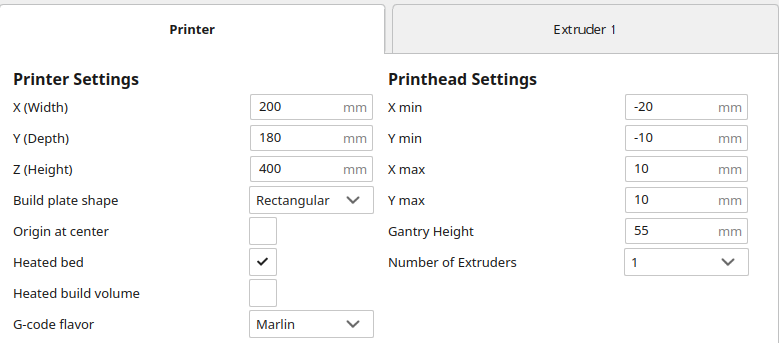
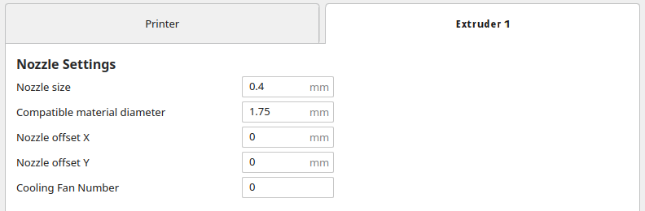

# Cura Machine Settings

All settings are for "Generic PLA"

## Printer Settings



## Extruder Settings




# Start G Code

```
; ---- Mike Printer Header
; Initial command to home and leveling
G21        ;metric values
G90        ;absolute positioning

G28        ;homing all axes
G29 L50 R150 F50 B150 V4 ;bed leveling

; Heat bed
;M140 S60   ;heat bed to 60C
;M190 S60   ;wait for bed temp

; Hotend setup
;M82        ;set extruder to absolute mode
;M106 S255  ;set nozzle fan to 100%
;M104 S190  ;set hotend temp to 180C
;M105       ;report temps
;M109 S190  ;wait for hotend

; Hurl some platic in a save corner
G0F3600X0Y0     ; move to a safe position
G92E0           ;zero the extruded length
G1F200E3        ;extrude 3mm of feed stock
G92E0           ;zero the extruded length again
G1F120          ;slower extrusion
; G1F{travel_speed}
; ------------
```

# End G Code

```
; ---- Mike Printer Footer
G0 X0 Y180 F2500 ; Move bed into unloading position
M140 S0     ;bed heat off
M106 S0     ;nozzle fan off
M104 S0     ;hotend temp off
M84 ; Put motors into idle mode
; ---------------
```

